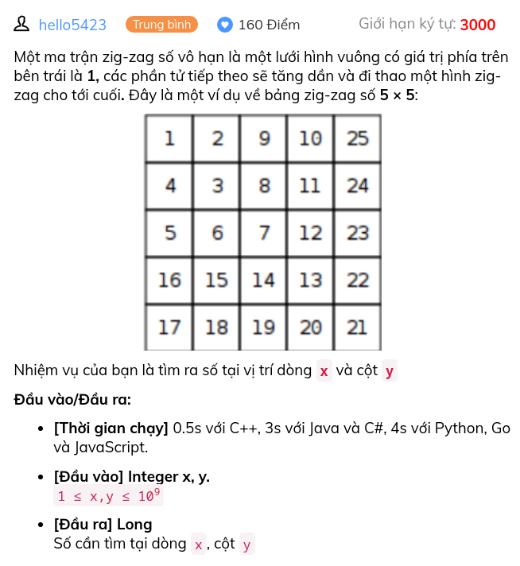

Một ma trận zig-zag số vô hạn là một lưới hình vuông có giá trị phía trên bên trái là 1, các phần tử tiếp theo sẽ tăng dần và đi thao một hình zig-zag cho tới cuối. Đây là một ví dụ về bảng zig-zag số 5 × 5:

Nhiệm vụ của bạn là tìm ra số tại vị trí dòng x và cột y

Đầu vào/Đầu ra:

[Thời gian chạy] 0.5s với C++, 3s với Java và C#, 4s với Python, Go và JavaScript.

[Đầu vào] Integer x, y. 
1 ≤ x,y ≤ 109

[Đầu ra] Long
Số cần tìm tại dòng x, cột y

